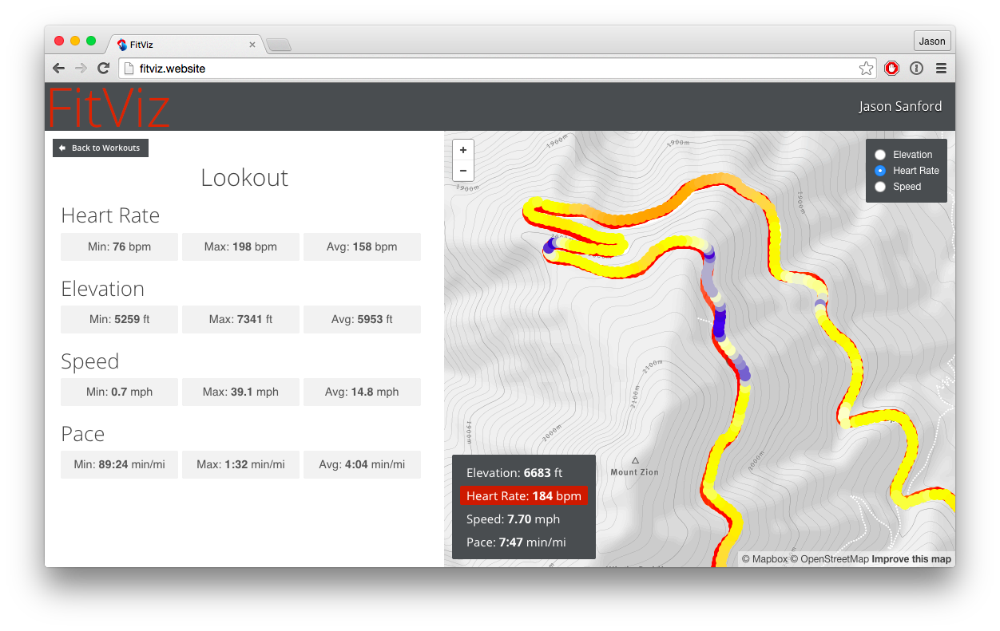
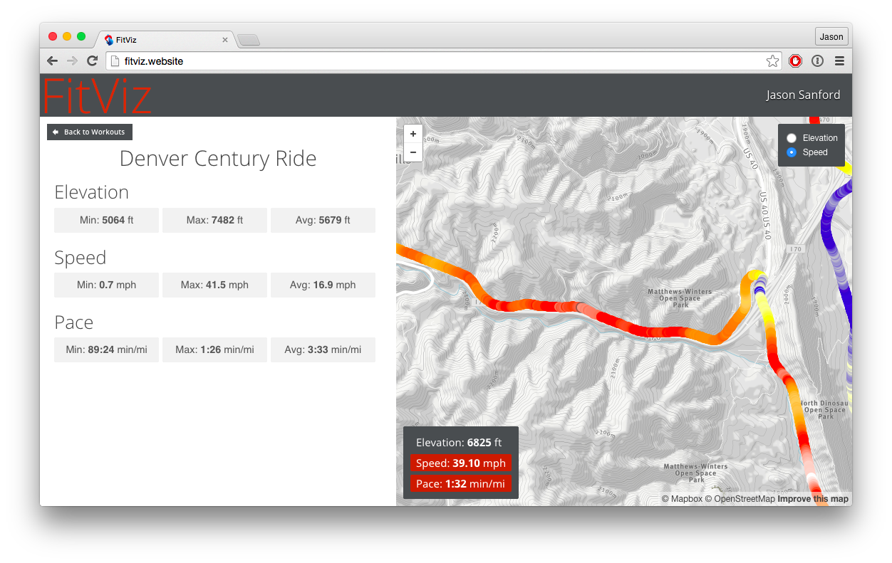

## FitViz

Visualize your workout time-series data like heart rate, speed, cadence and power point-by-point along your workout route.

This uses the [Under Armour](https://developer.underarmour.com/) and [Strava](http://strava.github.io/api/) APIs to gather detail information about your workouts and display them on a map.

